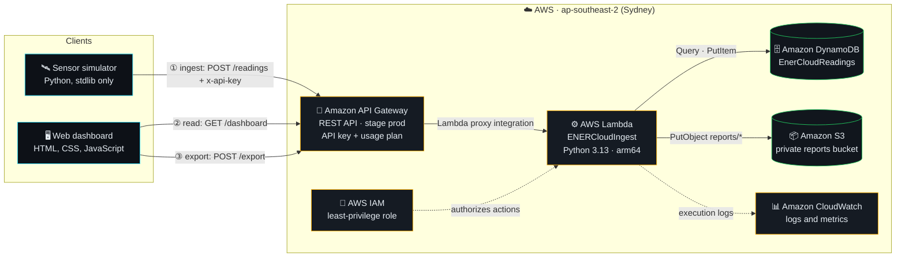
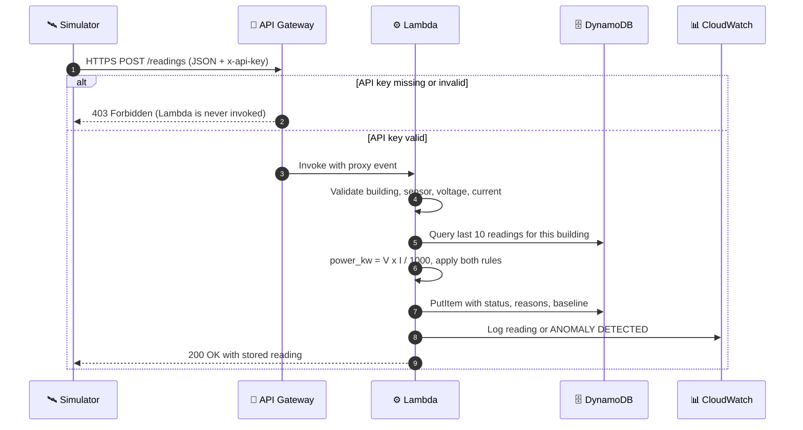
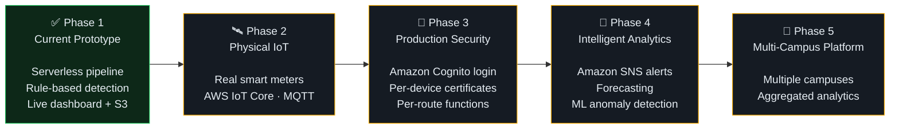

<div align="center">

# ⚡ ENERCloud

### Serverless Campus Energy Intelligence Platform

Real-time building energy ingestion, rule-based anomaly detection and live monitoring,<br/>
built entirely on managed AWS services with no servers to run.

<br/>


<br/>

**`Simulated meters` → `API Gateway` → `Lambda` → `DynamoDB` → `Dashboard` · `S3 reports` · `CloudWatch`**

</div>

<br/>

> [!NOTE]
> **The sensor input is simulated for this prototype, while the complete cloud processing and storage pipeline is deployed on AWS.**
> Every simulated reading is a real HTTPS request that is authenticated by API Gateway, processed by AWS Lambda, stored in Amazon DynamoDB and logged in Amazon CloudWatch.

---

## 📌 Contents

| | | |
|---|---|---|
| 🧭 [Project Snapshot](#-project-snapshot) | 🏗️ [Architecture](#%EF%B8%8F-architecture) | 🔐 [Security](#-security) |
| ❓ [Why ENERCloud Exists](#-why-enercloud-exists) | ☁️ [AWS Services](#%EF%B8%8F-aws-services-why-each-one-exists) | 🖥️ [Frontend](#%EF%B8%8F-frontend-dashboard) |
| ✨ [Core Features](#-core-features) | 🔄 [End-to-End Data Flow](#-end-to-end-data-flow) | 🛰️ [Sensor Simulator](#%EF%B8%8F-sensor-simulator) |
| 📊 [Demonstration Results](#-demonstration-results) | 🚨 [Anomaly Detection](#-anomaly-detection) | ✅ [Testing & Validation](#-testing--validation) |
| 🗄️ [Data Model](#%EF%B8%8F-data-model) | 🔌 [API Reference](#-api-reference) | 🚀 [Deployment](#-deployment) |
| 💻 [Local Development](#-local-development) | 🎓 [Cloud Concepts](#-cloud-engineering-concepts-demonstrated) | 📈 [Scalability](#-scalability) |
| 💰 [Cost Model](#-cost-model) | ⚠️ [Limitations](#%EF%B8%8F-limitations) | 🗺️ [Roadmap](#%EF%B8%8F-future-roadmap) |

---

## 🧭 Project Snapshot

<table>
  <tr>
    <td align="center" width="25%"><b>🏗️ Architecture</b><br/>Serverless AWS</td>
    <td align="center" width="25%"><b>🛰️ Input</b><br/>Simulated energy meters</td>
    <td align="center" width="25%"><b>⚙️ Processing</b><br/>AWS Lambda + Python 3.13</td>
    <td align="center" width="25%"><b>🗄️ Database</b><br/>Amazon DynamoDB</td>
  </tr>
  <tr>
    <td align="center"><b>🔌 API</b><br/>Amazon API Gateway (REST)</td>
    <td align="center"><b>📦 Storage</b><br/>Amazon S3 (private)</td>
    <td align="center"><b>📊 Monitoring</b><br/>Amazon CloudWatch</td>
    <td align="center"><b>🔐 Security</b><br/>IAM + API key / usage plan</td>
  </tr>
  <tr>
    <td align="center"><b>🌏 Region</b><br/><code>ap-southeast-2</code> (Sydney)</td>
    <td align="center"><b>🏢 Buildings</b><br/>5 campus blocks</td>
    <td align="center"><b>🚨 Detection</b><br/>Threshold + baseline deviation</td>
    <td align="center"><b>🖥️ Frontend</b><br/>HTML / CSS / JavaScript</td>
  </tr>
</table>

---

## ❓ Why ENERCloud Exists

Campus buildings consume electricity continuously, but raw meter readings do not automatically become useful operational information. Typically:

- **Visibility is poor.** Consumption is often seen only as a site-wide monthly bill, not per building and not as it happens.
- **Abnormal consumption goes unnoticed.** A lab left fully powered overnight or a faulty air-conditioning unit can run for days before anyone notices.
- **Data is scattered.** Without central storage there is no history to compare against and nothing to report from.
- **Running monitoring infrastructure is costly.** A traditional setup needs servers, a database and a web stack running around the clock for a workload made of small, bursty messages.

**How ENERCloud addresses this:**

| Need | ENERCloud's answer |
|---|---|
| Building-level visibility | Every reading is tagged with a building and shown on a live dashboard |
| Detecting abnormal use | Each reading is checked against a hard limit and against that building's own recent normal baseline |
| Centralised history | All readings are stored in one managed cloud database |
| Reporting | One-click export of JSON and CSV reports to cloud object storage |
| Low operational overhead | Managed, pay-per-use AWS services with no servers to provision or patch |

ENERCloud is an academic prototype that demonstrates this architecture end to end. It is not a commercial product.

---

## ✨ Core Features

| | Feature | What it does |
|---|---|---|
| ⚡ | **Real-time energy ingestion** | `POST /readings` accepts JSON readings (building, sensor, voltage, current) over HTTPS |
| ☁️ | **Serverless processing** | One AWS Lambda function (Python 3.13, arm64) validates, calculates, detects and stores |
| 🗄️ | **DynamoDB persistence** | Every reading is stored with its status, reasons and baseline |
| 🏢 | **Building-level monitoring** | Five buildings, each with its own normal band and hard limit |
| 🚨 | **Threshold anomaly detection** | Flags any reading above the building's hard limit |
| 📉 | **Baseline deviation detection** | Flags readings more than 1.5× the building's recent normal average |
| 🖥️ | **Live dashboard** | Campus load, building cards, alerts, readings table and anomaly timeline, refreshed every 5 s |
| 📦 | **S3 report export** | Writes JSON and CSV reports to a private, encrypted S3 bucket |
| 📊 | **CloudWatch monitoring** | Every invocation is logged; anomalies are logged as `ANOMALY DETECTED` |
| 🔐 | **API security** | API key + usage plan on sensor ingestion; least-privilege IAM role for Lambda |
| 🔁 | **Mock / live modes** | The dashboard can run on clearly labelled mock data or on the live AWS API |
| 🛰️ | **Sensor simulator** | Python simulator with stream, spike, load and dry-run modes |
| ✅ | **Automated testing** | 14 unit tests covering validation, the power formula and both anomaly rules |

---

## 🏗️ Architecture



The system has three request paths that share one API and one function:

| Path | Flow | Key required |
|---|---|---|
| ① **Ingestion** | Simulator → API Gateway → Lambda → DynamoDB | ✅ Yes |
| ② **Dashboard read** | Dashboard → API Gateway → Lambda → DynamoDB (5 queries, no scan) | ❌ No (prototype) |
| ③ **Report export** | Dashboard → API Gateway → Lambda → DynamoDB → Amazon S3 | ❌ No (prototype) |

Two concerns span all paths:

- **📊 Monitoring:** every Lambda invocation writes to a CloudWatch log group.
- **🔐 Security:** API Gateway enforces the API key and throttling on ingestion. IAM limits what the Lambda function can do in DynamoDB and S3.

> [!IMPORTANT]
> **Design decision:** the prototype routes all three endpoints through **one** Lambda function to keep deployment simple. The function dispatches on HTTP method and path, and unknown routes return `404`. A production version would split these into separate functions, each with its own least-privilege IAM role.

---

## ☁️ AWS Services: Why Each One Exists

| AWS Service | Role in ENERCloud | Why it is used | What ENERCloud actually does with it |
|---|---|---|---|
| 🔌 **Amazon API Gateway** | Front door | Gives a managed public HTTPS endpoint with routing, API keys and throttling, without running a web server | REST API `ENERCloudAPI`, stage `prod`, routes `POST /readings`, `GET /dashboard`, `POST /export`. Requires the API key on `/readings` and applies usage plan `enercloud-sensor-plan` (50 req/s, burst 100) |
| ⚙️ **AWS Lambda** | Compute | Runs code only when a request arrives and scales automatically, with no idle servers to pay for or patch | Function `ENERCloudIngest` (Python 3.13, arm64, 128 MB, 10 s timeout). Validates readings, calculates power, applies both anomaly rules, writes to DynamoDB, serves dashboard data and writes S3 reports |
| 🗄️ **Amazon DynamoDB** | Operational database | A managed NoSQL store with no instances to size; key-based queries suit per-building time-ordered data | Table `EnerCloudReadings` (on-demand). Partition key `building_id`, sort key `ts`. Stores every reading with status, reasons and baseline |
| 📦 **Amazon S3** | Report storage | Durable object storage for whole files, kept separate from the operational database | Bucket `enercloud-exports-siddharth-2026`. Private, Block Public Access on, ACLs disabled, SSE-S3. Reports written to `reports/YYYYMMDD/` as `.json` and `.csv` |
| 📊 **Amazon CloudWatch** | Observability | Collects Lambda logs and metrics automatically | Log group for `ENERCloudIngest`. Every reading, rejection, export and error is logged; anomalies are logged with the prefix `ANOMALY DETECTED` |
| 🔐 **AWS IAM** | Permissions | Controls exactly which AWS actions the function may perform, on which resources | Execution role with `AWSLambdaBasicExecutionRole` (logging) plus inline policy `ENERCloudDataAccess`: `dynamodb:PutItem` and `dynamodb:Query` on one table, `s3:PutObject` on `reports/*` only |

<details>
<summary><b>How the services interact</b></summary>

<br/>

1. **API Gateway** is the only component reachable from the internet. It checks the API key (for `/readings`), applies throttling and passes the full request to Lambda using *proxy integration*.
2. **Lambda** receives the request as an event containing the method, path and body. It reads its configuration (`TABLE_NAME`, `BUCKET_NAME`) from environment variables.
3. **Lambda** calls **DynamoDB** and **S3** through the AWS SDK. Each call is signed with temporary credentials from its **IAM** execution role; IAM rejects any action outside the policy.
4. Everything the function prints goes to **CloudWatch Logs**.
5. DynamoDB and S3 have **no public entry point** in this design. Clients never talk to them directly.

</details>

### Cloud concepts in play

| Concept | Where it shows up |
|---|---|
| ⚡ Serverless | Lambda: no servers to provision, patch or keep running |
| 🧠 Event-driven processing | Each HTTPS request triggers one Lambda invocation |
| 🗄️ Managed database | DynamoDB on-demand: no database server to operate |
| 📦 Object storage | S3 holds whole report files under keys |
| 🔌 API management | API Gateway: routing, keys, usage plan, throttling |
| 🔐 IAM-based security | Least-privilege execution role |
| 📊 Observability | CloudWatch logs and metrics |
| 💰 Pay-per-use | API Gateway, Lambda and DynamoDB on-demand are billed by usage |

---

## 🔄 End-to-End Data Flow



| Step | What happens |
|:---:|---|
| **1** | The simulator generates a reading: `building_id`, `sensor_id`, `voltage`, `current` |
| **2** | It sends an HTTPS `POST` to `/readings` with the `x-api-key` header |
| **3** | API Gateway validates the API key and applies the usage plan. Without a valid key it returns `403` |
| **4** | Lambda receives the request through proxy integration |
| **5** | Input is validated: known building, sensor registered to that building, voltage 180–260 V, current 0–200 A, numeric values. Invalid input returns `400` and nothing is stored |
| **6** | Power is calculated on the server: `power_kw = voltage × current / 1000` (power factor assumed to be 1.0) |
| **7** | The building's last 10 readings are queried and both anomaly rules run |
| **8** | The reading is written to DynamoDB with a server-generated timestamp, status, reasons and baseline |
| **9** | CloudWatch captures the execution log, including `ANOMALY DETECTED` lines |
| **10** | The dashboard calls `GET /dashboard` every 5 seconds and renders the latest data |
| **11** | When requested, `POST /export` queries recent readings and builds a JSON and a CSV report |
| **12** | Both reports are stored in the private S3 bucket under `reports/YYYYMMDD/` |

---

## 🚨 Anomaly Detection

Two explainable rules are implemented in [`lambda/ingest/processing.py`](lambda/ingest/processing.py) and covered by unit tests.

<table>
<tr>
<td width="50%" valign="top">

### 🅰️ Threshold detection

```text
power_kw > max_kw  →  ANOMALY
```

A hard per-building limit. It works from the very first reading, with no history needed.

</td>
<td width="50%" valign="top">

### 🅱️ Baseline deviation

```text
baseline = mean(last ≤10 NORMAL readings)
power_kw > 1.5 × baseline  →  ANOMALY
```

Only active once at least **5** previous normal readings exist for the building.

</td>
</tr>
</table>

**Building configuration:**

| Building ID | Dashboard name | Normal band | Hard limit (`max_kw`) |
|---|---|---|---|
| `ACAD-A` | Main Block | 3.0 – 6.0 kW | **9.0 kW** |
| `LAB-1` | Tech Park | 2.0 – 4.0 kW | **6.0 kW** |
| `LIB` | PG Block | 1.5 – 3.0 kW | **5.0 kW** |
| `HOSTEL-A` | N Block | 4.0 – 8.0 kW | **12.0 kW** |
| `ADMIN` | University Building | 1.0 – 2.5 kW | **4.0 kW** |

**Why two rules?**

- The **threshold rule** catches dangerous absolute loads, even when there is no history yet.
- The **baseline rule** catches loads that are unusual *for that building* but still below the hard limit. For example, 5.0 kW in `LAB-1` is under the 6.0 kW limit but well above a ~3 kW normal baseline.

**Why anomalous readings are excluded from the baseline:** if spikes were included in the average, each spike would raise the baseline, and the next spike would look less unusual. Using only `NORMAL` readings keeps the baseline representative of normal operation, so repeated anomalies are still detected.

When a rule fires, its reason is stored in the reading's `reasons` list and shown on the dashboard.

> [!TIP]
> **Worked example (reported LAB-1 live run)**
>
> ```text
> power     = 8.245 kW
> limit     = 6.0 kW         8.245 > 6.0            → THRESHOLD
> baseline  = 3.045 kW       1.5 × 3.045 = 4.568     8.245 > 4.568 → DEVIATION
> deviation = (8.245 / 3.045 − 1) × 100 = 171 %
> ```

---

## 🗄️ Data Model

<table>
<tr><td><b>Table</b></td><td><code>EnerCloudReadings</code></td></tr>
<tr><td><b>Capacity mode</b></td><td>On-demand</td></tr>
<tr><td><b>Partition key</b></td><td><code>building_id</code> (String)</td></tr>
<tr><td><b>Sort key</b></td><td><code>ts</code> (String)</td></tr>
<tr><td><b>Secondary indexes</b></td><td>None</td></tr>
<tr><td><b>Encryption at rest</b></td><td>AWS-owned key</td></tr>
</table>

**Why `building_id` + `ts`?** The partition key groups each building's readings together, and the sort key keeps them in time order. So "the latest N readings for building X" is a single, efficient `Query` with no table scan. That one access pattern drives the anomaly baseline, the dashboard and the export.

`ts` is generated on the server as an ISO-8601 UTC timestamp plus a short random suffix (for example `2026-10-05T17:09:17.123Z#a1b2c3`). The suffix prevents two readings that arrive in the same millisecond from overwriting each other.

<details>
<summary><b>Example stored item</b></summary>

<br/>

```json
{
  "building_id": "LAB-1",
  "ts": "2026-10-05T17:09:17.123Z#a1b2c3",
  "received_at": "2026-10-05T17:09:17.123Z",
  "sensor_id": "SEN-LAB-1-01",
  "voltage": 229.4,
  "current": 41.25,
  "power_kw": 9.462,
  "status": "ANOMALY",
  "reasons": [
    "THRESHOLD: 9.462 kW exceeds limit 6.0 kW",
    "DEVIATION: 9.462 kW is 231% above baseline 2.858 kW"
  ],
  "baseline_kw": 2.858
}
```

The `power_kw`, `reasons` and `baseline_kw` values come from a reported live LAB-1 run. The `voltage` and `current` values are illustrative, chosen to be consistent with 9.462 kW.

</details>

---

## 🔌 API Reference

**Base URL:** `https://<api-id>.execute-api.<region>.amazonaws.com/prod`

> The live endpoint URL is intentionally not published, because the dashboard and export routes are unauthenticated in this prototype.

| Method | Path | Purpose | API key |
|---|---|---|---|
| `POST` | `/readings` | Submit a sensor reading | 🔒 Required (`x-api-key`) |
| `GET` | `/dashboard` | Latest readings, anomalies and summary | 🔓 Not required (prototype) |
| `POST` | `/export` | Write a JSON + CSV report to S3 | 🔓 Not required (prototype) |

<details>
<summary><b><code>POST /readings</code>: submit a reading</b></summary>

<br/>

```bash
curl -X POST "$ENERCLOUD_API_URL/readings" \
  -H "Content-Type: application/json" \
  -H "x-api-key: $ENERCLOUD_API_KEY" \
  -d '{"building_id":"LAB-1","sensor_id":"SEN-LAB-1-01","voltage":230,"current":38.7}'
```

Example response, `200`:

```json
{
  "message": "stored",
  "reading": {
    "building_id": "LAB-1",
    "sensor_id": "SEN-LAB-1-01",
    "ts": "2026-10-05T17:09:17.123Z",
    "voltage": 230.0,
    "current": 38.7,
    "power_kw": 8.901,
    "status": "ANOMALY",
    "reasons": ["THRESHOLD: 8.901 kW exceeds limit 6.0 kW"],
    "baseline_kw": null
  }
}
```

In this example only the threshold rule fires, because the building does not yet have five normal readings to form a baseline.

| Status | Meaning |
|---|---|
| `200` | Reading validated, processed and stored |
| `400` | Validation failed: `{"errors": ["..."]}`; nothing stored |
| `403` | Missing or invalid API key: `{"message":"Forbidden"}`, returned by API Gateway |
| `500` | Unexpected server error (details are logged to CloudWatch, not returned) |

</details>

<details>
<summary><b><code>GET /dashboard</code>: dashboard data</b></summary>

<br/>

Runs one `Query` per building (newest 50 readings each) and returns:

```json
{
  "generated_at": "ISO-8601 timestamp",
  "summary": {
    "total_buildings": 5,
    "active_sensors": 5,
    "total_power_kw": 23.8,
    "anomaly_count": 1,
    "readings_count": 30
  },
  "buildings": [
    {
      "building_id": "LAB-1",
      "name": "Computer Lab 1",
      "type": "Laboratory",
      "sensor_id": "SEN-LAB-1-01",
      "normal_min_kw": 2.0,
      "normal_max_kw": 4.0,
      "max_kw": 6.0,
      "latest": "reading object or null"
    }
  ],
  "recent_readings": ["up to 20 reading objects, newest first"],
  "anomalies": ["up to 20 reading objects with status ANOMALY"]
}
```

The values shown are illustrative. Building `name` and `type` come from the backend configuration; the dashboard displays its own campus names (see [Frontend](#%EF%B8%8F-frontend-dashboard)).

</details>

<details>
<summary><b><code>POST /export</code>: export a report to S3</b></summary>

<br/>

Queries recent readings for every building and writes two objects to the private bucket.

```json
{
  "bucket": "enercloud-exports-siddharth-2026",
  "json_key": "reports/YYYYMMDD/enercloud-report-YYYYMMDDTHHMMSSZ.json",
  "csv_key": "reports/YYYYMMDD/enercloud-report-YYYYMMDDTHHMMSSZ.csv",
  "records": 30
}
```

</details>

Unknown routes return `404`. The full contract is in [`docs/api-contract.md`](docs/api-contract.md).

---

## 🔐 Security

<table>
<tr>
<td width="50%" valign="top">

### ✅ Implemented

- **HTTPS (TLS)** for all client traffic through API Gateway
- **API key** required on `POST /readings`. Requests without it get `403` before Lambda runs (tested)
- **Usage plan** `enercloud-sensor-plan`: 50 req/s, burst 100
- **Least-privilege IAM role:** `AWSLambdaBasicExecutionRole` + inline `ENERCloudDataAccess`
  - DynamoDB: `PutItem`, `Query` on `EnerCloudReadings` only
  - S3: `PutObject` on `reports/*` only
  - Broad `AmazonDynamoDBFullAccess` was removed
- **Private S3 bucket:** Block Public Access on, ACLs disabled. An anonymous request returned `AccessDenied` (tested)
- **Encryption at rest:** DynamoDB (AWS-owned key) and S3 (SSE-S3)
- **Server-side validation** and server-side power calculation
- **No API key in the frontend.** The dashboard stores only the API URL in the browser
- **Configuration through environment variables** (`TABLE_NAME`, `BUCKET_NAME`)

</td>
<td width="50%" valign="top">

### ⚠️ Prototype limitations

- The API key is a **shared secret**, not per-device authentication
- `GET /dashboard` and `POST /export` are **open** (no user login)
- One Lambda function, so one role covers all three routes
- The IAM policy uses `*` for the account ID in the DynamoDB ARN

### 🔮 Production path (future work)

- **Amazon Cognito** login for dashboard users
- **AWS IoT Core** with per-device certificates for meters
- Separate functions and roles per route
- Account-specific resource ARNs

</td>
</tr>
</table>

<details>
<summary><b>Inline IAM policy <code>ENERCloudDataAccess</code></b></summary>

<br/>

```json
{
  "Version": "2012-10-17",
  "Statement": [
    {
      "Sid": "ReadingsTableReadWrite",
      "Effect": "Allow",
      "Action": ["dynamodb:PutItem", "dynamodb:Query"],
      "Resource": "arn:aws:dynamodb:ap-southeast-2:*:table/EnerCloudReadings"
    },
    {
      "Sid": "ReportExportWriteOnly",
      "Effect": "Allow",
      "Action": "s3:PutObject",
      "Resource": "arn:aws:s3:::enercloud-exports-siddharth-2026/reports/*"
    }
  ]
}
```

The function cannot delete items or tables, scan other tables, or read, list or delete S3 objects.

</details>

---

## 🖥️ Frontend Dashboard

A dark, dense energy-operations console in plain HTML, CSS and JavaScript, with no framework and no build step.

| Area | What it shows |
|---|---|
| **Top bar** | Live / mock / error status, AWS region (read from the API URL), API latency, last update time |
| **Campus load** | Total campus kW, a session sparkline, change since the previous refresh, and each building's share of the load |
| **Summary tiles** | Buildings, active sensors, readings loaded, anomalies |
| **Building cards** | Current kW, a load bar with the normal band and hard-limit marker, a sparkline, voltage, current and limit. Anomalous buildings are highlighted in red |
| **Active alerts** | Buildings whose latest reading is anomalous, with limit and deviation |
| **Readings table** | The latest readings with voltage, current, power and status |
| **Anomaly timeline** | Recent anomalies with their threshold and deviation reasons |
| **Actions** | One-click S3 export showing the resulting object path, a system status panel, and connection settings |

- **Polling:** the dashboard calls `GET /dashboard` every **5 seconds**.
- **Trend data:** sparklines and the change indicator are built only from readings the API returned while the page is open. Nothing is generated or estimated.
- **Mock / live:** without an API URL, the dashboard runs on clearly labelled browser-generated mock data. With a URL, it reads the live AWS API.
- **Display names:** backend IDs are mapped to campus names in the frontend only. The API and database always use the stable IDs.

| Backend ID | `ACAD-A` | `LAB-1` | `LIB` | `HOSTEL-A` | `ADMIN` |
|---|---|---|---|---|---|
| **Displayed as** | Main Block | Tech Park | PG Block | N Block | University Building |

> [!NOTE]
> The frontend does **not** contain the sensor API key. Dashboard routes do not require it, so no secret is ever shipped to or stored in the browser.

---

## 🛰️ Sensor Simulator

[`simulator/simulator.py`](simulator/simulator.py) stands in for physical smart meters. It uses only the Python standard library.

| Mode | Command | Purpose |
|---|---|---|
| `stream` | `python3 simulator.py stream --interval 3` | Every building sends a normal reading at each interval |
| `spike` | `python3 simulator.py spike --building LAB-1` | Sends one deliberately abnormal reading (1.3–1.6 × the building's limit) |
| `load` | `python3 simulator.py load --requests 100 --concurrency 5 --out ../results/load_100.csv` | Concurrent request mode. Available, but not part of the reported validation |
| `--dry-run` | `python3 simulator.py --dry-run stream --rounds 3` | Sends nothing; runs the same `processing.py` logic locally |

Normal readings fluctuate ±15% around the middle of each building's normal band. Voltage is drawn around 230 V, and current is derived from the target power.

> [!IMPORTANT]
> **Simulated sensors, real cloud.** The meter hardware is simulated, but in live mode every reading is a real HTTPS request to the deployed API. It passes through the real API Gateway key check, is processed by the real Lambda function, and is stored in the real DynamoDB table.

---

## 📊 Demonstration Results

Observed outputs from the deployed AWS pipeline, as reported during the project demonstration.

<table>
<tr>
<td width="50%" valign="top">

#### 🟢 Live stream: all buildings normal

```text
ACAD-A     5.028 kW  NORMAL
LAB-1      3.166 kW  NORMAL
LIB        2.529 kW  NORMAL
HOSTEL-A   6.408 kW  NORMAL
ADMIN      1.984 kW  NORMAL
```

</td>
<td width="50%" valign="top">

#### 🔴 LAB-1 spike: anomaly detected

```text
LAB-1   8.245 kW   ANOMALY
THRESHOLD: 8.245 kW exceeds limit 6.0 kW
DEVIATION: 8.245 kW is 171% above baseline 3.045 kW
```

</td>
</tr>
</table>

| Signal | Value |
|---|---|
| Building | `LAB-1` (Tech Park) |
| Reading | **8.245 kW** |
| Hard limit | 6.0 kW |
| Baseline | 3.045 kW |
| Deviation | +171% |
| Status | 🔴 `ANOMALY` |
| Dashboard | Building card turned red; alert and timeline entry shown |

A second reported LAB-1 spike, **9.462 kW**, was flagged against a baseline of 2.858 kW (+231%), again by both rules.

---

## ✅ Testing & Validation

| Area | Test | Result |
|---|---|---|
| 🧪 Unit | Validation, power formula, both anomaly rules (`tests/test_processing.py`) | ✅ **14/14 passed** |
| ⚙️ Lambda | Normal reading (console test) | ✅ 200, `NORMAL` |
| ⚙️ Lambda | Spike reading (console test) | ✅ 200, `ANOMALY` with threshold reason |
| ⚙️ Lambda | Invalid input: sensor not registered to building | ✅ 400 with validation error |
| ⚙️ Lambda | Dashboard query (console test) | ✅ 200 |
| 🔐 IAM | Re-test after replacing broad DynamoDB access with the least-privilege policy, plus export | ✅ Passed; JSON and CSV written to S3 |
| 🔌 API | `POST /readings` without API key | ✅ **403** |
| 🔌 API | `POST /readings` with valid API key | ✅ **200**, reading stored |
| 🔌 API | `GET /dashboard` | ✅ 200 |
| 🛰️ Live | Simulator stream to the deployed API | ✅ Readings stored and shown on the dashboard |
| 🛰️ Live | LAB-1 spike to the deployed API | ✅ Flagged `ANOMALY` (threshold + deviation), shown on the dashboard |
| 🗄️ Data | DynamoDB persistence | ✅ Readings and anomaly items with reasons present |
| 📦 Storage | S3 export from the dashboard | ✅ JSON and CSV created under `reports/YYYYMMDD/` |
| 🔐 Storage | Anonymous S3 object access | ✅ `AccessDenied` |
| 📊 Monitoring | CloudWatch anomaly logs | ✅ `ANOMALY DETECTED` events observed |
| 🖥️ Frontend | Live polling and mock/live switching | ✅ Working |

### Runtime observations

Formal 10/100-request load testing was not performed in this prototype demonstration. CloudWatch execution observations were used for basic runtime evaluation.

---

## 📁 Project Structure

```text
ENERCloud/
├── frontend/                  🖥️  Dashboard (no build step)
│   ├── index.html             ·  layout
│   ├── style.css              ·  energy-console theme
│   ├── app.js                 ·  API calls, 5 s polling, rendering, export
│   └── mock.js                ·  labelled mock data for offline use
├── lambda/
│   └── ingest/                ⚙️  Deployed to AWS Lambda (ENERCloudIngest)
│       ├── lambda_function.py ·  routing, DynamoDB/S3 access, logging
│       └── processing.py      ·  validation, power calculation, anomaly rules
├── simulator/
│   └── simulator.py           🛰️  Simulated meters: stream, spike, load, dry-run
├── tests/
│   └── test_processing.py     🧪  14 unit tests for processing.py
├── docs/
│   └── api-contract.md        📄  Request/response formats
├── .gitignore
└── README.md
```

| Directory | Responsibility |
|---|---|
| `frontend/` | Everything the user sees. Talks only to the API |
| `lambda/ingest/` | The cloud backend. `processing.py` is pure Python (no AWS imports), so it can be unit-tested locally and deployed unchanged |
| `simulator/` | Generates simulated meter traffic for the deployed API, or locally in dry-run mode |
| `tests/` | Unit tests for the processing and anomaly logic |
| `docs/` | API contract |

---

## 🚀 Deployment

All resources were configured through the AWS Management Console in **`ap-southeast-2` (Sydney)**.

| # | Service | Configuration |
|:---:|---|---|
| 1 | 🗄️ **DynamoDB** | Table `EnerCloudReadings`. Partition key `building_id` (String), sort key `ts` (String), on-demand capacity |
| 2 | 📦 **S3** | Private bucket. Block Public Access on, ACLs disabled, SSE-S3 encryption |
| 3 | 🔐 **IAM** | Execution role with `AWSLambdaBasicExecutionRole` + the inline policy shown under [Security](#-security) |
| 4 | ⚙️ **Lambda** | Python 3.13, arm64, 128 MB, 10 s timeout. Upload `lambda_function.py` and `processing.py`; set `TABLE_NAME` and `BUCKET_NAME` |
| 5 | 🔌 **API Gateway** | REST API with `/readings` (POST), `/dashboard` (GET) and `/export` (POST), each using Lambda proxy integration. Deploy to stage `prod` |
| 6 | 🔑 **API key** | Create an API key and a usage plan attached to `prod`. Set **API key required** on `POST /readings` only, then redeploy |
| 7 | 📊 **CloudWatch** | Created automatically for the Lambda function; nothing to configure |

> [!CAUTION]
> Never commit API keys or AWS credentials. Provide the API URL and key to the simulator through environment variables only.

---

## 💻 Local Development

**Requirements:** Python 3.10+ and a modern browser. No third-party Python packages are needed.

```bash
git clone https://github.com/sxddhxrthg/enercloud.git
cd enercloud
```

**Run the unit tests:**

```bash
python3 -m unittest discover -s tests -v
```

**Run the simulator locally** (no AWS needed):

```bash
cd simulator
python3 simulator.py --dry-run stream --rounds 3 --interval 1
python3 simulator.py --dry-run spike --building LAB-1
```

**Send readings to a deployed API:**

```bash
export ENERCLOUD_API_URL="https://<api-id>.execute-api.<region>.amazonaws.com/prod"
export ENERCLOUD_API_KEY="<your-api-key>"

python3 simulator.py stream --interval 3
python3 simulator.py spike --building LAB-1
```

**Run the dashboard:**

```bash
cd frontend
python3 -m http.server 8000
# open http://localhost:8000 and enter the API URL under Connection settings
# leave it empty to use labelled mock data
```

---

## 🎓 Cloud Engineering Concepts Demonstrated

| Concept | How ENERCloud demonstrates it |
|---|---|
| ☁️ **Public Cloud** | All backend resources run in AWS, a public cloud provider, isolated within one account and governed by IAM |
| ⚡ **Serverless Computing** | Lambda runs code per request. There are no servers to provision, size, patch or pay for while idle |
| 🔌 **API Management** | API Gateway provides HTTPS endpoints, routing, API keys, a usage plan and throttling |
| 🧠 **Event-Driven Processing** | Each incoming request is an event that triggers one Lambda invocation |
| 🗄️ **Managed NoSQL Database** | DynamoDB on-demand stores readings with key-based access and no database server |
| 📦 **Object Storage** | S3 stores report files, separate from the operational database |
| 🔐 **IAM Security** | The execution role grants only the actions the code needs, on specific resources |
| 📊 **Observability** | CloudWatch captures logs and metrics for every invocation |
| 📈 **Horizontal Scalability** | Lambda handles concurrent requests in parallel execution environments; DynamoDB on-demand absorbs growth |
| 💰 **Pay-per-use** | Costs follow requests, execution time and stored data, with no upfront hardware |

**Where the service models fit:**

| Model | In ENERCloud |
|---|---|
| **IaaS** | Not used for compute; no virtual machines are managed. Running the backend on Amazon EC2 would have been the IaaS approach. S3 is closest to infrastructure-level storage delivered as a service |
| **PaaS** | Lambda, API Gateway and DynamoDB are managed platform services. AWS runs the servers, OS, runtime and scaling; ENERCloud supplies code, configuration and data |
| **SaaS** | The dashboard, from the administrator's point of view, is a finished application consumed over the web |

> [!NOTE]
> **Serverless is a pattern within cloud computing**, commonly implemented with managed PaaS-style services such as AWS Lambda. "Serverless" does not mean there are no servers. It means the cloud provider manages them, and the application is billed per use rather than per running server.

---

## 📈 Scalability

> This section describes **architectural** scalability. ENERCloud has **not** been formally benchmarked; no load-test figures are claimed.

| Layer | How it scales | What would change at large scale |
|---|---|---|
| 🔌 API Gateway | Managed, regional HTTPS front door | Raise the usage plan beyond the deliberate prototype limit (50 req/s, burst 100); move large fleets to **AWS IoT Core** over MQTT |
| ⚙️ Lambda | Runs additional concurrent executions as requests increase, within account quotas | Measure execution time, then size concurrency (request rate × execution time); split routes into separate functions |
| 🗄️ DynamoDB | On-demand capacity absorbs request growth; queries touch one partition and stay bounded | Partition by `sensor_id` to avoid hot partitions when many sensors share a building; add a secondary index for cross-building queries; TTL for old raw data |
| 📦 S3 | Object storage scales independently of the database | Lifecycle rules to move older reports to cheaper storage classes |
| 🧩 Decoupling | Clients only know the API; storage and compute can evolve behind it | Add alerting (SNS) or analytics without changing the clients |

For an Indian campus, a production deployment would use **`ap-south-1` (Mumbai)** for lower latency and data location.

---

## 💰 Cost Model

Every component is **pay-per-use**, with no upfront hardware.

| Service | Billed by |
|---|---|
| 🔌 API Gateway | Number of API calls |
| ⚙️ Lambda | Number of invocations + execution duration × memory (128 MB on arm64 keeps the rate low) |
| 🗄️ DynamoDB (on-demand) | Read/write requests + stored data |
| 📦 S3 | Stored GB + requests |
| 📊 CloudWatch | Log ingestion and storage |

The main cost drivers are the **number of sensors**, **reading frequency**, **data retention** and **log volume**. Actual cost depends on usage; no exact monthly bill was calculated for this prototype.

---

## ⚠️ Limitations

| | Limitation |
|---|---|
| 🛰️ | Physical sensors are **simulated**; there is no real meter or industrial hardware integration |
| 📏 | Anomaly detection is **simple and rule-based** (threshold + baseline), tuned on simulated data |
| ⚙️ | **One Lambda function** handles all routes under a single role |
| 🔑 | The API key is a **shared secret**, not per-device authentication |
| 🔓 | `/dashboard` and `/export` are **public** in the prototype |
| 🔁 | The dashboard uses **5-second polling**, not push updates |
| 📭 | **No SNS / email / SMS** alerting; alerts appear on the dashboard only |
| 🌏 | **Single AWS region** (Sydney), not the nearest region to the campus |
| 🎓 | **Academic prototype** scope, not a production deployment |

---

## 🗺️ Future Roadmap

> Everything beyond Phase 1 is **future work**. None of it is implemented.



---

## 🧠 Why This Project Matters

From an engineering perspective, ENERCloud demonstrates:

- **Cloud architecture:** composing managed services into one coherent system
- **AWS services:** API Gateway, Lambda, DynamoDB, S3, IAM and CloudWatch working together
- **Serverless backend:** event-driven compute with no server management
- **API design:** a small REST contract with clear authentication boundaries
- **Database modelling:** keys designed around the main access pattern
- **Security:** least-privilege IAM, private storage, and honest separation of implemented and future controls
- **Monitoring:** logs that make server-side behaviour verifiable
- **Frontend integration:** a live dashboard built on the same API
- **Automated testing:** core logic unit-tested before deployment
- **System thinking:** explicit trade-offs, limitations and a path to production

---

<div align="center">

## 👤 Author

**Siddharth Ganesh**<br/>
B.Tech Computer Science · SRM Institute of Science and Technology<br/>
Cloud Computing (21CSE362T) project

<br/>

⚡ *ENERCloud: serverless campus energy intelligence on AWS* ☁️

</div>
